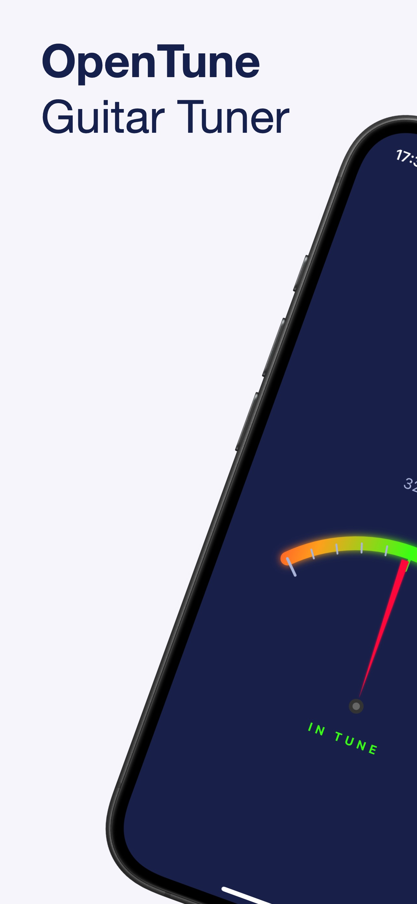
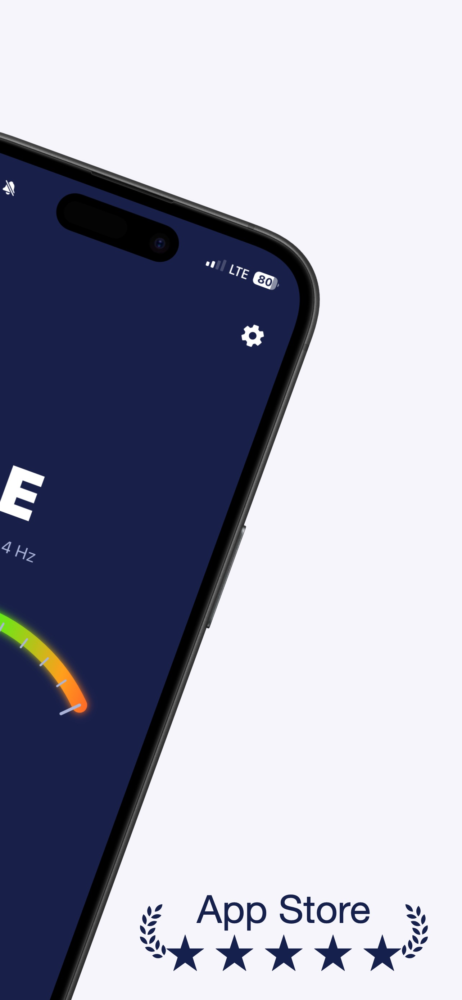
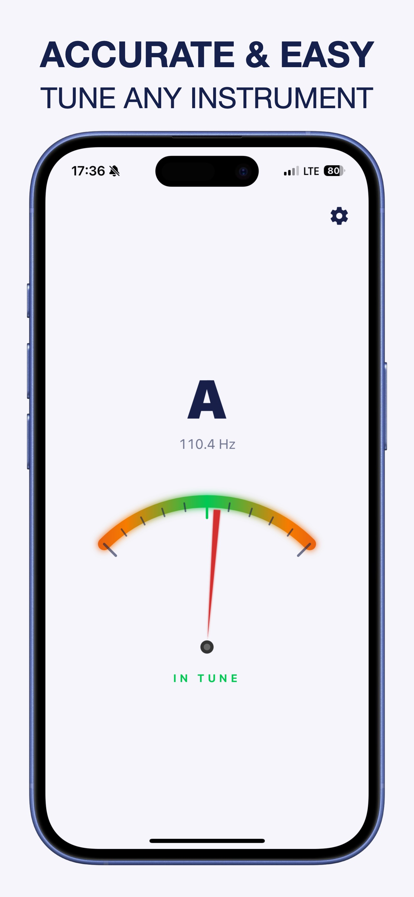

# 🎸 OpenTune: Guitar Tuner

> **No nonsense. No clutter. Just tuning.**
> The fastest and most accurate way to get your guitar pitch-perfect in seconds.

## 📱 Screenshots

  
  
  

## 🎯 The Vision

OpenTune was built for the musician who values time. Most tuning apps are bloated with unnecessary features, complex menus, and intrusive ads. OpenTune solves this with a "Open-and-Tune" philosophy.

Our goal is to provide professional-grade accuracy within a minimalist interface.

## ✨ Key Features

- **Instant Pitch Detection**: No setup required. Open the app, pluck a string, and get instant feedback.
- **High Precision Engine**: Powered by advanced DSP (Digital Signal Processing) for pinpoint accuracy.
- **Chromatic Mode**: Supports all notes, making it perfect for custom tunings.
- **Multi-Instrument Support**: Optimized for Acoustic Guitar, Electric Guitar, Bass, and Ukulele.
- **Visual Guidance**: Clean, high-contrast UI (Dark Mode) designed for stage and studio use.
- **Zero Clutter**: No intrusive ads or complex menus during the tuning process.

## ⚖️ Legal

By using OpenTune, you agree to our Terms and Conditions and Privacy Policy.

- [Terms & Conditions](./terms-and-conditions.html)
- [Privacy Policy](./privacy-policy.html)
